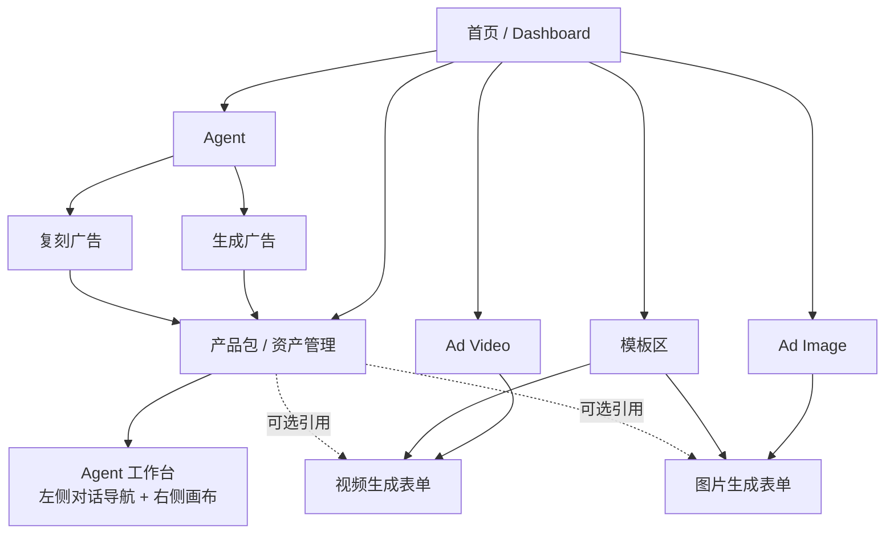
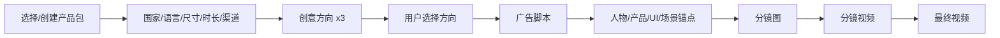
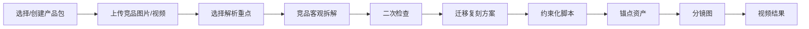

# Ad Studio 产品原型架构

面向广告素材设计师的 AI 广告生产平台。第一版要解决的不是“再做一个生图/生视频工具”，而是把广告设计师真实的三类进入场景组织成清晰入口：深度 Agent 工作流、快速素材生成、资产复用管理。

## 1. 核心定位

### 一句话定位

Ad Studio 是一个面向广告素材设计师的 AI 广告生产平台：既像素材生成工具一样低门槛进入，又能通过 Agent 工作台完成竞品拆解、广告复刻、脚本推导、分镜生成和最终视频产出。

### 第一版目标

第一版必须跑通到广告视频结果，而不是只停留在策略或脚本。

- 生成可投放广告视频
- 支持从 0 创作广告
- 支持上传竞品图片/视频并复刻广告
- 支持 Ad Video / Ad Image 空白表单生成
- 支持模板预填生成，包括数字人口播模板
- 支持产品包和素材资产沉淀，避免每次重复交代产品、场景、图片和品牌信息

### 目标用户

广告素材设计师。他们关心的不是模型有多聪明，而是：

- 能不能快速得到可用素材
- 能不能复刻已经被市场验证过的广告结构
- 能不能控制产品理解、脚本、人物、分镜和品牌资产不跑偏
- 能不能看清每个节点用了什么模型、花了多久、成本是多少

## 2. 用户进入场景

### 场景 A：知道自己要做什么广告

用户已经有明确目标，例如“我要给这个 App 做一条泰国 9:16 家庭安全广告”。这类用户会进入 Agent 的“生成广告”路径。

特点：

- 需要先引入产品包
- 需要 Agent 给多个创意方向
- 用户逐步确认方向、脚本、资产、分镜和视频
- 适合高价值、较复杂、需要推导的广告项目

### 场景 B：找到竞品素材，想复刻成自己的广告

这是更常见的投放工作流。用户先在行业里看到别人投放的广告，认为它可能被验证过，然后希望系统拆解它为什么有效，再结合自己的产品复刻。

特点：

- 需要产品包
- 需要上传竞品图片/视频
- 解析前要先问用户最关心什么
- 解析结果必须分成“客观拆解”和“迁移复刻”
- 后续进入 Agent 工作台跑脚本、锚点资产、分镜、视频

### 场景 C：不知道做什么，先逛模板找灵感

用户可能是商家或设计师，但没有明确广告方向，也没有竞品素材。首页模板区承担流量入口和降低门槛的作用。

特点：

- 不强制先创建产品包
- 先通过行业、渠道、素材类型筛选模板
- 点击模板后进入 Ad Video 或 Ad Image 表单
- 表单自动带入模板 prompt、参考图、比例、模型参数
- 用户可以选择绑定产品资产，也可以直接替换模板槽位生成

### 场景 D：只想快速生成一张图或一条视频

这类用户把 Ad Studio 当成素材工具。入口是 Ad Image / Ad Video，不进入 Agent 工作台。

特点：

- 默认是空白表单
- 可以上传参考图、输入 prompt、选择模型和尺寸
- 可以从模板进入，得到预填表单
- 数字人口播属于 Ad Video 下的模板/能力，不是独立一级入口

## 3. 顶层信息架构



关键判断：

- **Agent 是深度创作入口**：只有“生成广告”和“复刻广告”进入 Agent 工作台，并且需要产品包。
- **Ad Video / Ad Image 是基础生成入口**：默认进入空白表单；从模板进入时只是预填 prompt、参考图和参数。
- **模板是首页流量入口**：它不是单独工作流，而是把用户送进 Ad Video / Ad Image 表单。
- **产品包是资产管理入口**：导入识别过的产品都会在这里管理、可视化、复用。

## 4. 首页布局设计

首页第一眼要像素材工具，降低使用门槛；但要把最有价值的 Agent 能力放在主入口区，尤其突出“复刻竞品广告”。

```text
┌────────────────────────────────────────────────────────────┐
│ Ad Studio                                                   │
│ AI Ad Production Studio for Performance Creatives           │
│                                                            │
│ 主要入口                                                     │
│ ┌──────────────────────┐ ┌──────────────────────┐           │
│ │ Agent: 复刻竞品广告   │ │ Agent: 从 0 生成广告   │           │
│ │ 上传竞品素材 + 产品包 │ │ 输入产品，推导广告方案 │           │
│ │ [开始复刻]            │ │ [开始创作]            │           │
│ └──────────────────────┘ └──────────────────────┘           │
│                                                            │
│ 快速生成                                                     │
│ [Ad Video 空白生成] [Ad Image 空白生成] [数字人口播模板]       │
│                                                            │
│ 产品资产                                                     │
│ [导入产品 URL] [查看产品包资产库]                            │
└────────────────────────────────────────────────────────────┘

┌────────────────────────────────────────────────────────────┐
│ 模板区：从灵感开始                                           │
│ 分类：TikTok Ads / YouTube Ads / App / Ecommerce / Game     │
│ 子类：UGC / 数字人口播 / 商品演示 / Viral Hook / Before-After │
│ [模板卡片] [模板卡片] [模板卡片] [模板卡片]                  │
└────────────────────────────────────────────────────────────┘

┌────────────────────────────────────────────────────────────┐
│ Agent 项目示例                                               │
│ [竞品复刻案例] [App 安全广告案例] [电商爆款视频案例]          │
└────────────────────────────────────────────────────────────┘
```

### 首页模块优先级

| 模块 | 作用 | 点击后进入 |
| --- | --- | --- |
| Agent: 复刻竞品广告 | 主打高频场景，承接“我找到了竞品素材” | 产品包选择/创建 → 上传竞品 → 工作台 |
| Agent: 从 0 生成广告 | 承接明确需求用户 | 产品包选择/创建 → 参数选择 → 工作台 |
| Ad Video | 快速视频生成 | 空白视频表单 |
| Ad Image | 快速图片生成 | 空白图片表单 |
| 数字人口播 | 降低视频制作门槛 | 预置数字人口播模板的视频表单 |
| 模板区 | 给不知道做什么的用户找灵感 | 预填表单，不默认进 Agent |
| 产品包资产管理 | 管理已识别产品和可复用资产 | 产品资产库 |

## 5. 导航结构

```text
左侧主导航
├── Home
├── Agent
│   ├── 生成广告
│   └── 复刻广告
├── Ad Video
├── Ad Image
├── Templates
└── Products / Assets
```

### 导航规则

- `Agent` 下只有两个核心入口：生成广告、复刻广告。
- `Ad Video` 和 `Ad Image` 默认打开空白表单。
- `Templates` 可以作为首页模块，也可以作为独立模板浏览页。
- `Products / Assets` 管理产品包和可复用素材，不强迫所有用户先进入。
- 数字人口播不作为一级导航，放在 `Ad Video` 的模板分类或快捷模板里。

## 6. Agent 入口设计

Agent 是深度创作路径，进入前需要产品包，因为 Agent 的核心价值是“结合产品上下文做广告推导”。

### 6.1 生成广告入口

点击 `Agent → 生成广告` 后：

```text
┌────────────────────────────────────────────────────────────┐
│ Step 1: 选择或创建产品包                                     │
│ [输入产品 URL] [从产品资产库选择]                            │
│                                                            │
│ Step 2: 设置广告基础参数                                     │
│ 国家/语言： [泰国]                                          │
│ 渠道：     [TikTok] [Meta] [YouTube]                         │
│ 尺寸：     [9:16] [1:1] [16:9]                               │
│ 时长：     [15s] [30s] [60s]                                 │
│                                                            │
│ Step 3: 进入工作台                                           │
│ [让 Agent 生成创意方向]                                      │
└────────────────────────────────────────────────────────────┘
```

进入工作台后，Agent 先给多个方向：

- 痛点放大型
- 场景剧情型
- 产品演示型
- UGC 口播型
- 对比冲突型

用户选择方向后，再进入脚本、资产、分镜和视频生成。

### 6.2 复刻广告入口

点击 `Agent → 复刻广告` 后：

```text
┌────────────────────────────────────────────────────────────┐
│ Step 1: 选择或创建产品包                                     │
│ [输入产品 URL] [从产品资产库选择]                            │
│                                                            │
│ Step 2: 上传竞品广告素材                                     │
│ [上传图片] [上传视频]                                       │
│                                                            │
│ Step 3: 选择解析重点                                         │
│ 你最关心这条素材的什么？                                     │
│ [Hook] [脚本逻辑] [剧情设计] [画面构图] [节奏] [角色] [CTA]    │
│                                                            │
│ Step 4: 进入工作台                                           │
│ [开始解析并生成复刻方案]                                     │
└────────────────────────────────────────────────────────────┘
```

解析结果不应该只展示“竞品是什么”，而要直接服务复刻：

```text
竞品客观拆解
├── Hook：前 3 秒如何抓注意力
├── 情绪曲线：紧张 → 代入 → 解决 → 行动
├── 剧情结构：人物、冲突、转折、结果
├── 视觉结构：镜头、构图、字幕、节奏
└── CTA：最后如何促成行动

迁移复刻方案
├── 哪些结构可以保留
├── 哪些元素必须替换成当前产品
├── 当前产品对应的痛点和卖点映射
├── 不允许模型自行添加的内容
└── 3 个可选复刻方向
```

## 7. Agent 工作台

用户明确要求 Agent 工作台采用“左侧对话导航 + 右侧画布”。RunningHub 的价值主要在协作节奏和节点证据链，不照搬左右布局。

```text
┌────────────────────────────┬─────────────────────────────────────┐
│ 左侧：Agent 对话导航         │ 右侧：Canvas 画布                    │
│                            │                                     │
│ 当前项目：Family Locator    │ [产品核心锚点] ─→ [竞品解析]          │
│ 当前阶段：复刻方案确认       │        │              │              │
│                            │        ↓              ↓              │
│ AI 正在做什么               │ [角色参考] ─→ [分镜图] ─→ [视频节点]  │
│ 需要你确认什么              │                                     │
│ 选项 A / B / C              │ 节点展示：输入、输出、模型、耗时、成本 │
│                            │                                     │
│ 上传参考图 / @ 引用节点      │                                     │
│ [确认继续] [调整] [取消]     │                                     │
└────────────────────────────┴─────────────────────────────────────┘
```

### 左侧 Agent 的职责

- 控制阶段推进
- 用有限选项收敛决策
- 解释 AI 当前在做什么
- 每一步等待用户确认
- 支持用户自然语言修改
- 支持上传素材和引用画布节点
- 生成结构化方案卡、进度卡、资产卡、确认卡

### 右侧 Canvas 的职责

- 展示节点关系
- 展示生成结果
- 展示每个节点的模型、耗时、成本
- 支持用户手动新增文/图/视频/音频/脚本节点
- 支持查看详情、重跑、替换输入、锁定结果、分支对比、拖拽节点

关键约束：画布是对话过程的结果沉淀，不反向影响对话主流程。用户可以在画布做局部编辑，但 Agent 阶段状态仍由左侧流程控制。

### Agent 消息组件

| 组件 | 用途 |
| --- | --- |
| 普通消息 | 解释当前阶段、风险和下一步 |
| 方案卡 | 展示多个创意方向或复刻方向 |
| 解析卡 | 展示竞品拆解、Hook、脚本逻辑、情绪曲线 |
| 进度卡 | 展示哪些节点 finished、running、waiting |
| 资产卡 | 展示产品包、人物、Logo、参考图、视频片段 |
| 执行确认卡 | 确认执行 / 调整方案 / 取消 |
| 错误修正卡 | 说明问题、建议局部重跑方案 |

## 8. Ad Video / Ad Image 生成入口

这两个入口是基础生成能力，不默认进入 Agent 工作台。

### 8.1 Ad Video 空白表单

```text
┌────────────────────────────────────────────────────────────┐
│ Ad Video                                                    │
│                                                            │
│ Prompt                                                      │
│ [描述你想生成的视频...]                                      │
│                                                            │
│ 参考素材                                                     │
│ [+ 上传图片] [+ 上传视频] [+ 从资产库选择]                   │
│                                                            │
│ 参数                                                         │
│ 模型：[Seedance 2.0]  比例：[9:16]  时长：[15s]  清晰度：[720p]│
│                                                            │
│ 可选能力                                                     │
│ [数字人口播] [商品展示] [App 演示] [UGC 风格]                 │
│                                                            │
│ 成本预估：xx credits    [生成视频]                            │
└────────────────────────────────────────────────────────────┘
```

### 8.2 Ad Image 空白表单

```text
┌────────────────────────────────────────────────────────────┐
│ Ad Image                                                    │
│                                                            │
│ Prompt                                                      │
│ [描述你想生成的广告图...]                                    │
│                                                            │
│ 参考素材                                                     │
│ [+ 上传产品图] [+ 上传人物图] [+ 从资产库选择]                │
│                                                            │
│ 参数                                                         │
│ 模型：[GPT Image]  尺寸：[1:1] [4:5] [9:16]  风格：[UGC]       │
│                                                            │
│ 成本预估：xx credits    [生成图片]                            │
└────────────────────────────────────────────────────────────┘
```

### 8.3 从模板进入表单

模板不是独立生成器。模板点击后打开 Ad Video 或 Ad Image 表单，并预填：

- prompt
- 参考图
- 输出类型
- 推荐比例
- 推荐模型
- 必填槽位
- 示例结果

```text
模板：TikTok 商品演示 UGC
进入：Ad Video 表单

已预填：
Prompt：one-take UGC product demo...
参考图：人物厨房场景图
比例：9:16
时长：15s
槽位：产品图、卖点、CTA
```

数字人口播也是同样逻辑：

```text
模板：数字人口播 - App 功能讲解
进入：Ad Video 表单

已预填：
口播结构、人物风格、镜头、字幕样式、声音语气
```

## 9. 模板区设计

模板区的核心作用是让“不知道做什么”的用户快速找到方向。

### 模板分类

```text
渠道
├── TikTok Ads
├── YouTube Shorts
├── Meta Reels
└── App Store / Google Play Preview

产品类型
├── App
├── Ecommerce
├── Game
├── Local Services
└── SaaS

素材形态
├── UGC
├── 数字人口播
├── 商品演示
├── App Demo
├── Viral Hook
├── Before / After
├── Testimonial
└── Meme / Reaction

输出类型
├── Ad Video
└── Ad Image
```

### 模板卡片字段

```json
{
  "templateId": "tiktok-product-demo-001",
  "title": "TikTok 商品演示 UGC",
  "channel": "TikTok",
  "productType": "Ecommerce",
  "outputType": "video",
  "previewAsset": "asset",
  "defaultPrompt": "string",
  "referenceAssets": ["asset"],
  "requiredSlots": ["product_image", "selling_point", "cta"],
  "recommendedModel": "Seedance 2.0",
  "defaultRatio": "9:16",
  "defaultDuration": "15s"
}
```

### 模板详情

```text
┌────────────────────────────────────────────────────────────┐
│ 模板预览视频 / 图片                                          │
├────────────────────────────────────────────────────────────┤
│ 适合：TikTok / 商品演示 / UGC                                │
│ 需要：产品图、核心卖点、CTA                                  │
│ 输出：15s 9:16 视频                                          │
│                                                            │
│ [使用模板生成] [收藏] [查看同类模板]                         │
└────────────────────────────────────────────────────────────┘
```

点击“使用模板生成”：

- 视频模板 → `Ad Video` 预填表单
- 图片模板 → `Ad Image` 预填表单
- 数字人口播模板 → `Ad Video` 预填表单，并打开数字人相关参数

## 10. 产品包 / 资产管理

资产管理不是所有流程的强制入口，但它是平台复用能力的基础。

### 资产类型

| 资产类型 | 来源 | 用途 |
| --- | --- | --- |
| 产品包 | 产品 URL 解析、手动创建 | Agent 工作流必需，表单生成可选引用 |
| Logo / Icon | 产品解析、用户上传 | 品牌一致性、CTA、App UI |
| 产品图 | 产品解析、用户上传 | 商品展示、广告图、视频参考 |
| App 截图 / UI | 产品解析、用户上传 | App Demo、复刻广告 |
| 人物参考图 | 生成、上传 | 人物一致性 |
| 场景参考图 | 生成、上传 | 分镜一致性 |
| 竞品素材 | 用户上传 | 竞品解析和复刻 |
| 历史生成结果 | 生成节点保存 | 后续作为参考图/视频 |

### 产品包字段

```json
{
  "productName": "string",
  "logoOrIcon": "asset",
  "productImages": ["asset"],
  "coreSellingPoints": ["string"],
  "targetAudience": ["string"],
  "painPoints": ["string"]
}
```

### 资产库页面

```text
┌────────────────────────────────────────────────────────────┐
│ Products / Assets                                           │
│ [导入产品 URL] [手动创建产品包]                              │
├────────────────────────────────────────────────────────────┤
│ 产品包列表                                                   │
│ [Family Locator] [Baby Bottle Brand] [Game App]              │
├────────────────────────────────────────────────────────────┤
│ 当前产品包详情                                               │
│ Logo/Icon     产品图      App 截图                           │
│ 核心卖点      用户画像    痛点                               │
│                                                            │
│ 关联资产：人物 / 场景 / 竞品素材 / 历史生成结果               │
│ [编辑] [用于生成广告] [用于复刻广告] [用于视频表单]            │
└────────────────────────────────────────────────────────────┘
```

### 产品解析 Loading

```text
正在解析你的产品

✓ 读取产品页面结构
✓ 提取品牌名称、Logo/Icon 和产品图片
● 理解核心卖点、用户画像和痛点
○ 生成产品资料包
```

## 11. Agent 工作流细节

### 11.1 从 0 生成广告



关键确认点：

- 产品包是否准确
- 广告参数是否正确
- 选择哪个创意方向
- 脚本是否可接受
- 人物、产品、UI、场景锚点是否锁定
- 分镜图是否进入视频生成
- 视频版本是否作为最终结果

### 11.2 复刻广告



复刻的关键约束：

```text
保留：
- 叙事结构
- Hook 位置
- 情绪曲线
- 镜头节奏
- CTA 机制

替换：
- 产品名称
- 产品画面
- 卖点表达
- 用户痛点
- 使用场景

禁止：
- 新增竞品中不存在的剧情段落
- 添加当前产品未提供的功能承诺
- 用内部推理词写进视频 prompt
```

### 11.3 Agent 阶段状态

| 阶段 | 输入 | 输出 | 用户确认 |
| --- | --- | --- | --- |
| 产品包确认 | 产品 URL / 资产库产品 | 产品资料包 | 名称、图、卖点、人群、痛点 |
| 参数确认 | 国家、语言、比例、时长、渠道 | 生产参数 | 是否正确 |
| 竞品上传 | 图片/视频 | 竞品素材节点 | 是否使用该素材 |
| 解析重点 | 用户选择重点 | Focus 配置 | 重点是否正确 |
| 竞品拆解 | 竞品素材 | 客观拆解 | 是否理解正确 |
| 复刻方案 | 产品包 + 拆解 | 迁移方案 | 选择方向 |
| 脚本 | 方案 | 脚本/口播/字幕 | 是否修改 |
| 锚点资产 | 脚本 + 产品资产 | 人物/场景/UI/Logo | 是否锁定 |
| 分镜图 | 脚本 + 锚点 | Storyboard frames | 是否进入视频 |
| 视频 | 分镜图 + prompt | Shot videos / final video | 选择版本 |

## 12. Canvas 节点设计

现有 `xyflow-demo` 已有 `text/image/video/audio/script` 基础节点，第一版建议保持视觉节点类型不扩张，在业务层增加语义字段。

### 节点基础结构

```json
{
  "id": "node_001",
  "kind": "image",
  "businessType": "character_reference",
  "title": "主角人物参考图",
  "status": "completed",
  "locked": true,
  "input": {},
  "output": {},
  "model": "GPT Image",
  "durationMs": 18000,
  "cost": {
    "credits": 8,
    "usd": 0.12
  },
  "version": 1,
  "parentNodeIds": ["script_001"]
}
```

### 业务节点类型

| businessType | kind | 用途 |
| --- | --- | --- |
| product_pack | text/image | 产品资料包 |
| product_asset | image | Logo、产品图、App UI |
| competitor_asset | image/video | 上传的竞品素材 |
| competitor_analysis | text/script | 竞品拆解 |
| clone_strategy | text | 迁移复刻方案 |
| creative_concept | text | 从 0 创意方向 |
| ad_script | script | 广告脚本 |
| shot_prompt | text | 分镜 prompt |
| character_reference | image | 人物一致性参考 |
| scene_reference | image | 场景参考 |
| storyboard_frame | image | 分镜图 |
| shot_video | video | 单镜头视频 |
| final_video | video | 最终视频 |
| voiceover | audio | 配音 |
| avatar_video | video | 数字人口播 |

### 画布分组

```text
产品核心锚点
├── 产品资料包
├── Logo/Icon
├── 产品图 / App UI
└── 核心卖点

竞品解析与复刻策略
├── 竞品素材
├── 客观拆解
├── 二次检查
└── 复刻方案

脚本与 Prompt
├── 广告脚本
├── 口播 / 字幕
└── 分镜 prompt

一致性资产
├── 人物参考
├── 场景参考
└── 品牌 / UI 参考

视频生产
├── 分镜图
├── 分镜视频
└── 最终视频
```

### 节点详情面板

```text
┌──────────────────────────────┐
│ 主角人物参考图                 │
│ Status: completed / locked    │
├──────────────────────────────┤
│ Preview                       │
│ [image/video/text]            │
├──────────────────────────────┤
│ Input                         │
│ - 来自脚本节点                 │
│ - 引用产品包：Family Locator   │
├──────────────────────────────┤
│ Output                        │
│ - 图片 URL                    │
│ - prompt                      │
├──────────────────────────────┤
│ Model: GPT Image              │
│ Time: 18s                     │
│ Cost: 8 credits               │
├──────────────────────────────┤
│ [锁定] [替换输入] [重跑] [分支] │
└──────────────────────────────┘
```

## 13. 质量控制规则

### 竞品解析

问题：Gemini 多模态解析效果好，但可能没有解析到用户真正关注的重点。

产品化规则：

- 解析前必须让用户选择关注重点
- 第一次输出客观拆解
- 第二次用 checklist 检查是否覆盖重点
- 不确定内容显式标记，不假装确定
- 解析结果必须可映射到当前产品

### 脚本复刻

问题：模型会自作主张加入它认为更好的剧情或功能。

产品化规则：

- 分离“保留结构”和“替换内容”
- 输出复刻 diff
- 禁止新增未确认剧情段落
- 禁止添加产品未声明功能
- 增强内容必须单独让用户确认

### 人物一致性

问题：视频模型每次调用独立，没有稳定上下文。

产品化规则：

- 脚本包含人物时，必须先生成或上传人物参考图
- 人物参考图确认前，不进入分镜图
- 锁定人物后，所有分镜图节点引用该人物资产
- 若用户上传真实人物参考，优先级高于系统生成图

### 分镜 prompt

问题：视频 prompt 被上下文污染，写入“上一镜头”“该角色继续”等视频模型不理解的描述。

产品化规则：

- 每个分镜 prompt 必须单镜头自洽
- 显式写入主体、场景、动作、镜头、构图、光线、品牌信息
- 禁止上下文依赖词

```text
禁止词：
继续、上述、前一个镜头、同一角色、保持一致、如前所述、该人物、这个场景

标准结构：
Subject:
Scene:
Action:
Camera:
Composition:
Lighting:
Product/Brand:
Style:
Negative Constraints:
Reference Images:
```

## 14. MVP 页面清单

| 页面 | 必要性 | 说明 |
| --- | --- | --- |
| 首页 | P0 | 三类用户路径分流，模板流量入口 |
| Agent 入口页 | P0 | 生成广告 / 复刻广告 |
| 产品包选择/创建页 | P0 | 仅 Agent 必需 |
| 产品解析 Loading | P0 | 产品 URL 导入时使用 |
| 产品包确认页 | P0 | 锁定产品上下文 |
| 竞品上传与解析重点页 | P0 | 复刻路径必需 |
| Agent 工作台 | P0 | 左侧对话导航 + 右侧画布 |
| Ad Video 表单 | P0 | 空白生成 + 模板预填 |
| Ad Image 表单 | P0 | 空白生成 + 模板预填 |
| 模板浏览页/首页模板区 | P0 | 灵感入口 |
| 模板详情弹窗 | P0 | 预览、槽位、使用模板 |
| 产品包/资产管理 | P0 | 管理产品和可复用资产 |
| 节点详情面板 | P0 | 输入、输出、模型、耗时、成本 |
| 最终视频预览/交付 | P0 | 结果闭环 |
| 多项目历史 | P2 | Demo 阶段单项目单流程，可暂缓 |
| 团队协作 | P2 | 暂缓 |

## 15. MVP 优先级

### P0

- 首页三类用户入口
- Agent：生成广告
- Agent：复刻广告
- 产品 URL 导入和产品包确认
- 竞品图片/视频上传
- 解析重点选择
- Agent 工作台基础布局
- Canvas 节点展示
- 节点详情：模型、耗时、成本占位字段
- Ad Video 空白表单
- Ad Image 空白表单
- 模板点击后预填表单
- 数字人口播作为视频模板
- 最终视频结果节点

### P1

- 节点重跑
- 节点锁定
- 替换输入
- 分支对比
- 从资产库选择素材
- 人物一致性链路
- 分镜 prompt 校验
- 竞品解析二次 check
- 成本明细

### P2

- 多项目管理
- 团队协作
- 模板市场
- 节点级模型路由
- 自动化工作流配置
- 投放平台适配导出

## 16. 第一版推荐 Demo

第一版 demo 建议主跑“竞品复刻”，因为它最符合真实投放心理：用户更愿意基于已验证素材复刻，而不是盲信从 0 创意。

```text
案例：
Family Locator App

路径：
首页 → Agent 复刻广告 → 选择/创建产品包 → 上传竞品视频 →
选择解析重点 → 工作台 → 客观拆解 → 迁移复刻方案 →
脚本确认 → 人物 / App UI / 场景锚点 → 分镜图 →
分镜视频 → 最终视频
```

同时保留两条轻路径：

```text
模板路径：
首页模板区 → 选择 TikTok App UGC 模板 → Ad Video 预填表单 → 生成视频

空白生成路径：
首页 / 导航 → Ad Image 或 Ad Video → 空白表单 → 上传参考素材 → 生成
```

## 17. 实现建议

基于现有 `xyflow-demo`，第一版不要推翻画布。

1. 保留 `text/image/video/audio/script` 视觉节点。
2. 增加业务字段：`businessType`、`status`、`locked`、`model`、`durationMs`、`cost`、`version`。
3. 新增 Agent 工作台壳：左侧 Agent 阶段流，右侧接现有 React Flow 画布。
4. Agent 每次确认后向画布追加节点和 edge。
5. Ad Video / Ad Image 独立做表单页，模板只负责预填表单。
6. 产品包/资产库作为独立模块，同时给 Agent 和表单提供可选引用。
7. 生成能力先走 mock adapter，接口保持真实结构，后续逐步替换模型。

## 18. 核心判断

Ad Studio 的产品架构应分成三层：

```text
深度层：Agent 工作台
用于生成广告和复刻广告，强依赖产品包，解决复杂广告生产。

工具层：Ad Video / Ad Image
用于快速生成素材，默认空白表单，模板只做预填。

资产层：Products / Assets
沉淀产品包、品牌图、人物、场景、竞品素材和历史生成结果。
```

这样首页能同时承接三类用户：

- 有明确广告目标的人，进入 Agent 生成广告。
- 有竞品素材的人，进入 Agent 复刻广告。
- 没有明确方向的人，先逛模板，再进入 Ad Video / Ad Image 表单。

第一版重点是把这套入口、状态和节点骨架搭稳。模型质量、解析规则、prompt 规则和成本优化可以逐步迭代，但入口关系不能混乱：Agent 是深度流程，Ad Video / Ad Image 是快速工具，产品包是资产系统。
